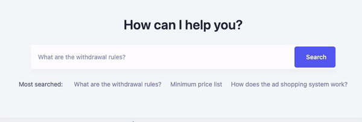

<p align="center"><br></p>
<h3 align="center">@ssibrahimbas/writer</h3>
<p align="center">
  Print function that works anywhere running JavaScript or TypeScript
</p>

<br>

### Example



### Thanks

Although I wrote the source code for the package, there is one person (with a site he made) and an article that inspires me.

Emin Yormaz - (ItemSatis Search Placeholder)

> link: https://www.itemsatis.com

Michael Smart - (ES6 Generators in JavaScript, a Real-World Use Case)

> link: https://levelup.gitconnected.com/es6-generators-in-javascript-9cc301ed7665

<br></br>

### What Is It?

This is a print package. It serves to print text just as if you clicked on a keyboard at certain intervals.

In addition, it has deletion. With this feature you can create amazing placeholders of search inputs!

### Installation


To include this package in your project, run the following command:

```
npm install @ssibrahimbas/writer
```

> or with yarn
> 
> ```
> yarn add @ssibrahimbas/writer
> ```
> 
And try this:

```typescript
import { ListWriter } from "@ssibrahimbas/writer"

const listWriter = new ListWriter();
listWriter.writeList(console.log, ["Sami", "Salih"])

```

And this result:

```
S
Sa
Sam
Sami
Sam
Sa
S

S
Sa
Sal
Sali
Salih
Sali
Sal
Sa
S
```

### Usage

#### Usage With PlaceHolder - Vue3 & TypeScript

```vue
<script setup lang="ts">
import {reactive, onMounted} from "vue"
import {ListWriter} from "@ssibrahimbas/writer"

const listWriter = new ListWriter();

type State = {
  placeholder: string;
  list: Array<string>;
}

const state = reactive<State>({
  placeholder: "",
  list: ["Macbook Pro", "Tea", "Cookie", "Cool Lime", "White Chocolate Mocha", "Ice Latte"]
})
const setPlaceholder = (val : string) : void => {
  state.placeholder = val;
}

onMounted(() : void => {
  listWriter.writeList(setPlaceholder, state.list);
})
</script>

<template>
  <input :placeholder="state.placeholder" />
</template>
```

#### Usage With PlaceHolder - Vue3

```vue
<script setup>
import {reactive, onMounted} from "vue"
import {ListWriter} from "@ssibrahimbas/writer"

const listWriter = new ListWriter();

const state = reactive({
  placeholder: "",
  list: ["Macbook Pro", "Tea", "Cookie", "Cool Lime", "White Chocolate Mocha", "Ice Latte"]
})
const setPlaceholder = (val) => {
  state.placeholder = val;
}

onMounted(() => {
  listWriter.writeList(setPlaceholder, state.list);
})
</script>

<template>
  <input :placeholder="state.placeholder" />
</template>
```

#### Usage With PlaceHolder - Vanilla

```javascript
import {ListWriter} from "@ssibrahimbas/writer"

const listWriter = new ListWriter();
const inputEL = document.querySelector("#my-input");
const list = ["Macbook Pro", "Tea", "Cookie", "Cool Lime", "White Chocolate Mocha", "Ice Latte"];

const setPlaceholder = (val) => {
  inputEL.placeholder = val;
}

listWriter.writeList(setPlaceholder, list);
```

#### Usage With PlaceHolder - React

```javascript
import React, { useState, useEffect } from 'react';
import {ListWriter} from "@ssibrahimbas/writer"

const listWriter = new ListWriter();

const SearchBar = () => {
  const [placeholder, setPlaceholder] = useState("");

  useEffect(() => {
    const list = [
      "Macbook Pro",
      "Tea",
      "Cookie",
      "Cool Lime",
      "White Chocolate Mocha",
      "Ice Latte",
    ];
    listWriter.writeList(setPlaceholder, list);
  }, []);

  return <input placeholder={placeholder} />;
}
```

#### Usage With Normal - NodeJS

```typescript
import {WordWriter} from "@ssibrahimbas/writer"

const wordWriter = new WordWriter();

wordWriter.writeWord(console.log, "Tea or Cookie")
```

## Documentation

### WordWriter

With word writer you can trigger and customize words typing, erasing and typing and deleting animations.

#### Write Word

Abstract:

```typescript
writeWord(render: Render, word: string, options?: WriteWordOptions) : Promise<void>;
```

Type WriteWordOptions:

```typescript
{
  writerSpeed?: number; // default 60
}
```

Example with non customized:

```typescript
import {WordWriter} from "@ssibrahimbas/writer"

const wordWriter = new WordWriter();

wordWriter.writeWord(console.log, "Tea or Cookie")
```

Example with customized:

```typescript
import {WordWriter} from "@ssibrahimbas/writer"

const wordWriter = new WordWriter();

wordWriter.writeWord(console.log, "Tea or Cookie", {writerTime: 300})
```

Note: the writerTime option here is in ms, default 250

#### Remove Word

Abstract:

```typescript
removeWord(render: Render, word: string, options?: RemoveWordOptions) : Promise<void>;
```

Type RemoveWordOptions:

```typescript
{
  removeSpeed?: number; // default 30
}
```

Example with non customized:

```typescript
import {WordWriter} from "@ssibrahimbas/writer"

const wordWriter = new WordWriter();

wordWriter.removeWord(console.log, "Tea or Cookie")
```

Example with customized:

```typescript
import {WordWriter} from "@ssibrahimbas/writer"

const wordWriter = new WordWriter();

wordWriter.removeWord(console.log, "Tea or Cookie", {removeSpeed: 300})
```

#### Write And Remove Word

Abstract:

```typescript
writeAndRemoveWord(render: Render, word: string, options?: WriteAndRemoveWordOptions) : Promise<void>;
```

Type WriteAndRemoveWordOptions:

```typescript
{

  // all fields are in milliseconds

  writerSpeed?: number; // default 60
  removeSpeed?: number; // default 60
  waitProcessTime?: number; // how long to wait between remove or write, default 500
  waitProcessEndTime?: number; // the amount of time to wait after the erase operation is finished and possibly before the write operation begins, default 0
  infinite?: boolean; // use infinite list writer, default null
}
```

Example with non customized:

```typescript
import {WordWriter} from "@ssibrahimbas/writer"

const wordWriter = new WordWriter();

wordWriter.writeAndRemoveWord(console.log, "Tea or Cookie")
```

Example with customized:

```typescript
import {WordWriter} from "@ssibrahimbas/writer"

const wordWriter = new WordWriter();

wordWriter.writeAndRemoveWord(console.log, "Tea or Cookie", {removeSpeed: 300, writerSpeed: 200, waitProcessTime: 1000, waitProcessEndTime: 500})
```

### stop

Stops writing for the `writeAndRemoveWord` function.
Cancels at the start of the next word.

Example:
```typescript
import {WordWriter} from "@ssibrahimbas/writer"

const wordWriter = new WordWriter();

wordWriter.writeAndRemoveWord(console.log, "Tea or Cookie", {removeSpeed: 300, writerSpeed: 200, waitProcessTime: 1000, waitProcessEndTime: 500})
setTimeout(() => {
  wordWriter.stop();
}, 500)
```

### start

Start writing for the `writeAndRemoveWord` function.

Example:
```typescript
import {WordWriter} from "@ssibrahimbas/writer"

const wordWriter = new WordWriter();

wordWriter.writeAndRemoveWord(console.log, "Tea or Cookie", {removeSpeed: 300, writerSpeed: 200, waitProcessTime: 1000, waitProcessEndTime: 500})
setTimeout(() => {
  wordWriter.stop();
  setTimeout(() => {
    wordWriter.start();
    wordWriter.writeAndRemoveWord(console.log, "Tea or Cookie", {removeSpeed: 300, writerSpeed: 200, waitProcessTime: 1000, waitProcessEndTime: 500})
  }, 1600)
}, 500)
```

### ListWriter

With ListWriter, you can use your lists with printing and deletion animations.

#### writeList 

Abstract

```typescript
writeList(render: Render, list: string[], options?: WriteAndRemoveListOptions) : Promise<void>
```

type WriteAndRemoveListOptions:

```typescript

  // all fields are in milliseconds
  
  writerSpeed?: number; // default 60
  removeSpeed?: number; // default 30
  waitProcessTime?: number; // how long to wait between remove or write, default 0
  waitWordTime?: number; // how long to wait between list items, default 300
  waitProcessEndTime?: number; // the amount of time to wait after the erase operation is finished and possibly before the write operation begins, default 500
  infinite?: boolean; // use infinite list writer, default true
```


Example with non customized:

```typescript
import {ListWriter} from "@ssibrahimbas/writer"

const listWriter = new ListWriter();

listWriter.writeList(console.log, ["Tea or Cookie", "Coffee?", "Yes Sure"])
```

Example with customized:

```typescript
import {ListWriter} from "@ssibrahimbas/writer"

const listWriter = new ListWriter();

listWriter.writeList(console.log, ["Tea or Cookie", "Coffee?", "Yes Sure"], {removeSpeed: 300, writerSpeed: 200, waitProcessTime: 1000, waitWordTime: 1000,  waitProcessEndTime: 500})
```

### stop

Stops writing for the `writeList` function.
Cancels at the start of the next word.

Example:
```typescript
import {ListWriter} from "@ssibrahimbas/writer"

const listWriter = new ListWriter();

listWriter.writeList(console.log, ["Tea or Cookie", "Coffee?", "Yes Sure"])
setTimeout(() => {
  listWriter.stop();
}, 500)
```

### start

Start writing for the `writeList` function.

Example:
```typescript
import {ListWriter} from "@ssibrahimbas/writer"

const listWriter = new ListWriter();

listWriter.writeList(console.log, ["Tea or Cookie", "Coffee?", "Yes Sure"])
setTimeout(() => {
  listWriter.stop();
  setTimeout(() => {
    listWriter.start();
    listWriter.writeList(console.log, ["Tea or Cookie", "Coffee?", "Yes Sure"])
  }, 1600)
}, 500)
```

## Types

### Render

The render function.

```TypeScript
(val: string) => any | Promise<any>;
```